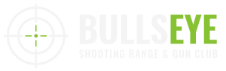
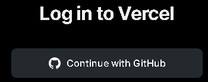
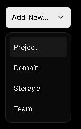
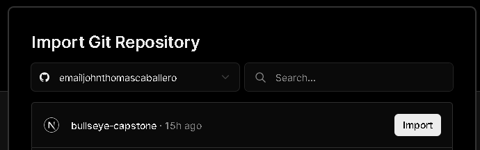
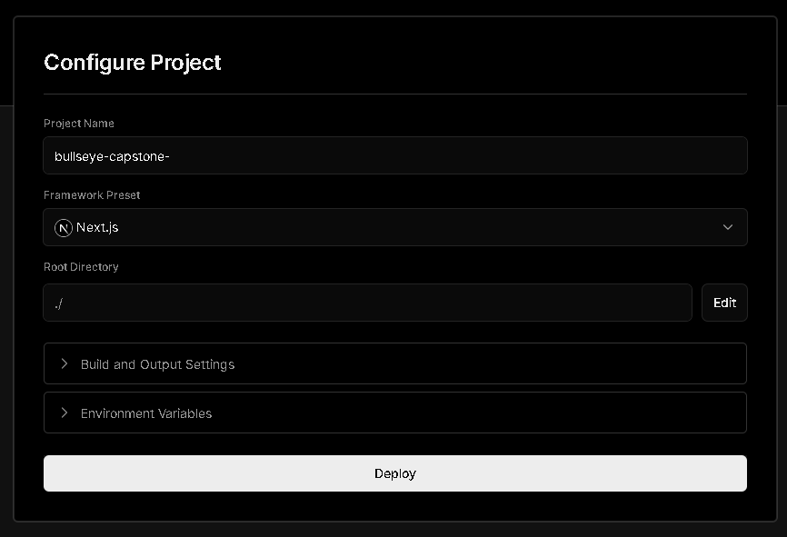

<h1 id="readme-top">BULLSEYE -(Shooting Range & Gun Club)</h1>
<p class="header">Your gateway to the world of shooting sports and firearms expertise. Join our Shooting Range & Gun Club and experience precision, safety, and camaraderie in one place.</p>

<p align="center">
  <a href="https://github.com/emailjohnthomascaballero">
    
  </a>
</p>

## Table of Contents
<details>
  <summary>VIEW TABLE OF CONTENTS</summary>
  <ol type="I">
    <li><a href="#about">About the Project</a></li>
    <li><a href="#languages">Languages & Tools Used</a></li>
    <li><a href="#developers">Developers</a></li>
    <li><a href="#project-link">Project Link</a></li>
    <li><a href="#project-style">Project Style</a></li>
    <li><a href="#usage">Usage</a></li>
    <li><a href="#pages">Pages</a></li>
    <li><a href="#steps">Steps on Deploying Using Vercel</a></li>
    <li><a href="#creative">Creative Planning</a></li>
  </ol>
</details>

<p align="right">(<a href="#readme-top">back to top</a>)</p>

<h2 id="about">I. About the Project</h2>
At BULLSEYE, we aspire to become a global leader in the world of shooting sports and firearms expertise. Our vision is to provide a safe, inclusive, and state-of-the-art environment for shooting sports enthusiasts of all backgrounds and experience levels. We are committed to offering a unique combination of education, camaraderie, and expert guidance, setting the standard for excellence in the industry.

Our mission is to create a thriving community where individuals passionate about shooting sports can come together in a safe and welcoming atmosphere. We are dedicated to fostering responsible firearm ownership through comprehensive training and education programs. BULLSEYE is committed to providing top-notch facilities and equipment, ensuring our members have the resources to develop their skills and enjoy their passion for shooting sports to the fullest.

We are dedicated to promoting ethical and lawful gun use while advocating for responsible gun ownership. Our commitment to continuous innovation, education, and inspiration sets us apart, ensuring our members and visitors are always at the forefront of the latest developments in the world of shooting sports. We actively collaborate with industry experts and organizations to advance the culture of firearm safety and responsible gun ownership, making a positive and lasting impact on the community we serve.

<!-- Back to Top -->
<p align="right">(<a href="#readme-top">back to top</a>)</p>

<h2 id="languages">II. Languages and Tools Used</h2>

#### Planning
  
</br>

#### Design
    


#### Development


#### Libraries


#### Deployment


#### Presentation


<!-- Back to Top -->
<p align="right">(<a href="#readme-top">back to top</a>)</p>

<h2 id="developers">III. Developers</h2>
<a href="https://github.com/emailjohnthomascaballero"></a>

<!-- Back to Top -->
<p align="right">(<a href="#readme-top">back to top</a>)</p>

<h2 id="project-link">IV. Project Link</h2>

https://bullseye-capstone.vercel.app/

<!-- Back to Top -->
<p align="right">(<a href="#readme-top">back to top</a>)</p>

<h2 id="project-style">V. Project Style</h2>
Color Scheme

<a href=""></a> 
<a href=""></a>

<a href=""></a>
<a href=""></a>
<a href=""></a>

Logo

</br>

Favicon

</br>

Typography

**Oswald**

<!-- Back to Top -->
<p align="right">(<a href="#readme-top">back to top</a>)</p>

<h2 id="usage">VI. Usage</h2>

_Below is an example of how you can install and setup the application on your device._

1. Clone the repo
   ```sh
   git clone https://github.com/emailjohnthomascaballero/bullseye-capstone.git
   ```
2. Install NPM packages
   ```sh
   npm install
   ```
3. Run dev
   ```sh
   npm run dev
   ```
   
<p align="right">(<a href="#readme-top">back to top</a>)</p>

<h2 id="pages">VII. Pages</h2>

- <a href="https://bullseye-capstone.vercel.app/">Homepage</a>
- <a href="#">News</a>
- <a href="https://bullseye-capstone.vercel.app/blogs">Blog</a>
- <a href="https://bullseye-capstone.vercel.app/contact">Contact Us</a>

<!-- Back to Top -->
<p align="right">(<a href="#readme-top">back to top</a>)</p>

<h2 id="steps">VIII. Steps on Deploying Using Vercel</h2>
  Step 1: Login Your Github
  
   </br>

  Step 2: Add New Project

   </br>

  Step 3: Import Your Project

  
  
  Step 4: Deploy Your Project

   

<!-- Back to Top -->
<p align="right">(<a href="#readme-top">back to top</a>)</p>

<h2 id="creative">IX. Creative Planning</h2>

[Notion](https://www.notion.so/BULLEYE-Shooting-Range-Gun-Club-d4fe901c8d3b4348b2fce29a96604f14?pvs=4)

[Figma Design](https://www.figma.com/file/ky8VNsHtgkBYkv73II6iIr/Bullseye?type=design&node-id=0%3A1&mode=design&t=k3795FvfR707UjmD-1)

<!-- Back to Top -->
<p align="right">(<a href="#readme-top">back to top</a>)</p>
